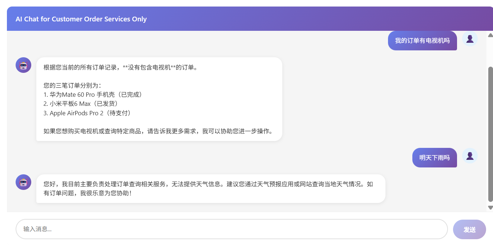
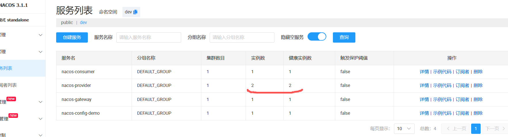

# Nacos Practice

#### Nacos server v3.1.1:


http://106.54.39.161:8080

```xml
        <maven.compiler.source>17</maven.compiler.source>
        <maven.compiler.target>17</maven.compiler.target>
        <spring-cloud.version>2023.0.1</spring-cloud.version>
        <spring-cloud-alibaba.version>2023.0.1.0</spring-cloud-alibaba.version>
        <nacos-client.version>3.1.1</nacos-client.version>
```

## Module Structure

- **nacos-common**: Common entity and utility classes shared across modules

  - `User.java`: User entity class
  - `Result.java`: Unified API response wrapper

- **nacos-provider**: Service provider module

  - Provides user information and config query services
  - Add AI capability from Aliyun qwen-turbo: Order status query Intelligence, based on spring-AI

- **nacos-consumer**: Service consumer module

  - Calls services from nacos-provider and nacos-config-demo
  - Uses Feign for service-to-service communication

- **nacos-config-demo**: Nacos Config Center integration demo

  - Demonstrates dynamic config refresh from Nacos Config Center

- **nacos-gateway**: API Gateway module

  - Routes requests to nacos-consumer, nacos-provider, and nacos-config-demo

- **nacos-ai-agent**: AI Agent module
  - Integrates Aliyun qwen-turbo for customer order status query intelligence, using langchain4j, can be supported by backend DB
  - will support other AI models in the future or offline ollama
  - Provides a UI for AI chatting - http://106.54.39.161:8880
    

## API Documentation

### Nacos Gateway Rules

- **/consumer/**: Forward to nacos-consumer service
- **/provider/**: Forward to nacos-provider service
- **/config-demo/**: Forward to nacos-config-demo service

### Nacos Gateway API

#### only gateway exposed 8880 outside, other services are hidden

#### final services in nacos after startup



## Kubernetes Deployment

#### k8s-nacos-config.yaml

- nacos-secret: Stores Nacos server password , echo -n "mypass" | base64
- nacos-config: Configures Nacos server address

#### k8s-deployment.yaml

- nacos-provider: Service provider deployment
- nacos-consumer: Service consumer deployment
- nacos-config-demo: Config demo deployment
- nacos-gateway: Gateway deployment

#### steps

1. kubectl apply -f k8s-nacos-config.yaml
2. kubectl apply -f k8s-deployment.yaml
3. Check services in Nacos console

   ```
   # 检查配置资源
   kubectl get secret nacos-secret
   kubectl get configmap nacos-config

   # 检查应用部署
   kubectl get pods
   kubectl get services

   # 分布式事务， 可通过seata, 但是推荐避开， 通过业务设计迎合80%以上的需求
   ```

4. Test APIs through gateway
   - http://106.54.39.161:8880/consumer/user/123
   - http://106.54.39.161:8880/config-demo/info
   - http://106.54.39.161:8880/provider/user/456
   - http://106.54.39.161:8880/provider/config
